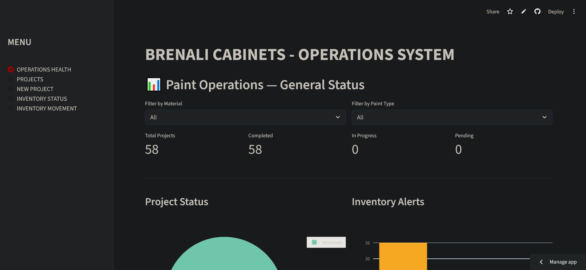
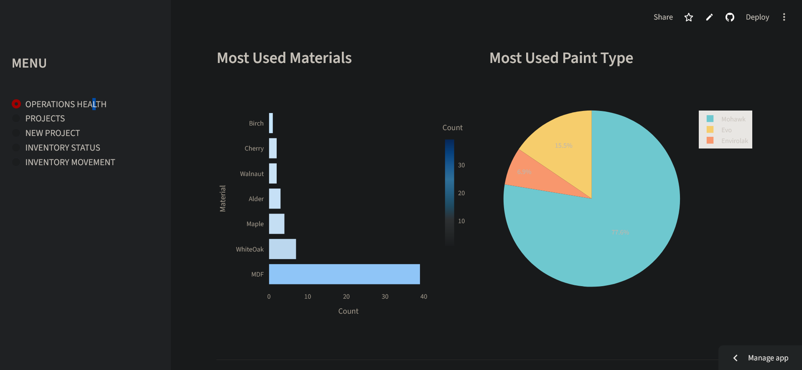
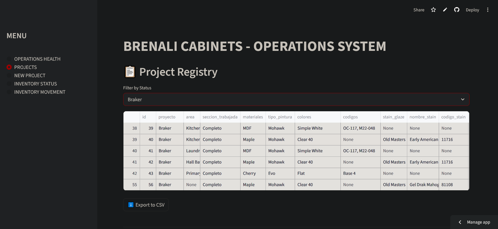
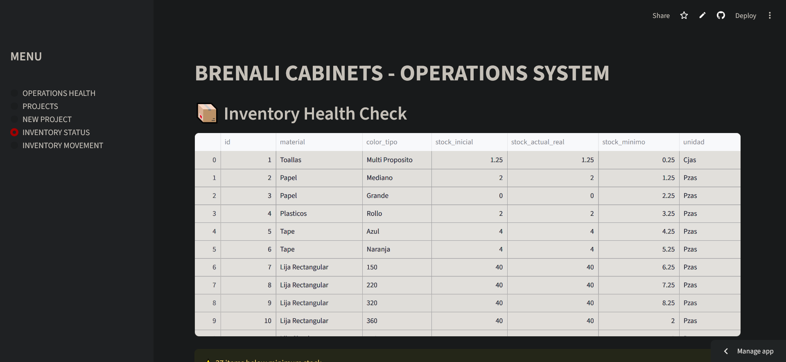

# Brenali Cabinets — Operations System

[](https://brenali-ops-8karuxprqnvh6eufoxln48.streamlit.app/)
[](https://python.org)
[](https://railway.app)
[](https://streamlit.io)

> A full-stack operations management system built for a real cabinet manufacturing business — designed, developed, and deployed by a painting operations lead with 10+ years of hands-on manufacturing experience.

---

## The Problem

Brenali Cabinets operated with **zero documentation infrastructure**. Project tracking, inventory control, and paint specifications were managed entirely through memory and informal communication — creating bottlenecks, rework, and lost throughput.

**Before this system:**
- No centralized record of projects, materials, or color specs
- Inventory managed manually with no minimum stock alerts
- Corrections and rework consumed significant production time
- Capacity limited to 1–2 jobs per month due to disorganization

---

## The Solution

A end-to-end operations platform built from scratch — replacing informal processes with a structured, data-driven system accessible from any device.

**Results after implementation:**
- 📉 **80% reduction** in paint corrections and rework
- ⏱️ **75% time savings** in inventory management and organization
- 📈 **Production capacity increased** from 1–2 to 3–5 jobs per month

---

## Features

| Module | Description |
|---|---|
| **Operations Health** | Live dashboard with project status, inventory alerts, and material/paint analytics |
| **Project Registry** | Full project log with filtering by status and CSV export |
| **Project Intake** | Form to register new projects with all paint and material specs |
| **Inventory Health Check** | Real-time stock levels with low/out-of-stock alerts |
| **Log Material Usage** | Track inventory movements linked to specific projects |

---

## Tech Stack

| Layer | Technology |
|---|---|
| Frontend | Streamlit |
| Backend | Python + pandas |
| Database | PostgreSQL (Railway) |
| ORM/Connector | psycopg2 |
| Visualization | Plotly Express |
| Deployment | Streamlit Cloud + Railway |
| Version Control | Git + GitHub |

---

## Screenshots

***Operations Health Dashboard**



**Project Registry**


**Inventory Health Check**

---

## Run Locally

### Prerequisites
- Python 3.10+
- PostgreSQL installed locally
- Git

### Setup

```bash
# Clone the repository
git clone https://github.com/K3L3-VR4/brenali-ops.git
cd brenali-ops

# Install dependencies
pip install -r requirements.txt

# Create your secrets file
mkdir .streamlit
```

Create `.streamlit/secrets.toml` with your local PostgreSQL credentials:

```toml
[postgres]
host = "localhost"
database = "brenali_ops"
user = "postgres"
password = "YOUR_PASSWORD"
port = 5432
```

```bash
# Run the app
streamlit run app.py
```

---

## Project Structure

```
brenali-ops/
├── .streamlit/
│   └── secrets.toml        # Local credentials (not tracked by git)
├── data/
│   └── Drive white - Operations.xlsx
├── scripts/
│   ├── migrar.py           # Projects migration script
│   ├── migrar_inventario.py # Inventory migration script
│   ├── brenali.sql         # Projects table schema
│   └── brenaliinv.sql      # Inventory table schema
├── app.py                  # Main Streamlit application
├── requirements.txt
└── .gitignore
```

---

## Author

**Williams** — Painting Operations Lead transitioning into Data & Operations Analytics  
10+ years of manufacturing experience | Bay Area, CA  

[](www.linkedin.com/in/williamsvargas)

---

*Built with real operational data from a live manufacturing environment.*
